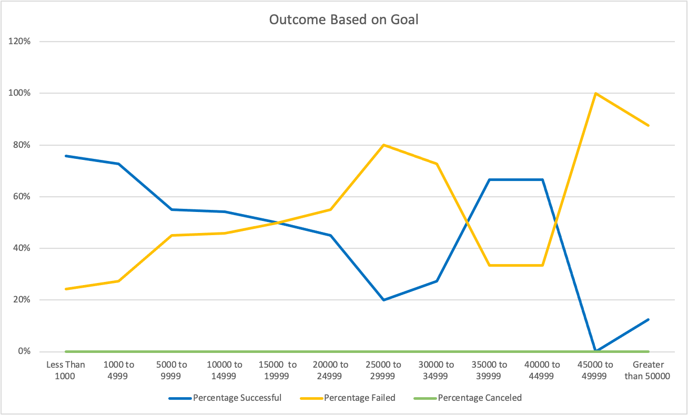

# Kickstarter-Challenge

## Overview of Project

The aim of the project is to perform data analysis using the dataset from excel. The client is looking into insights on how different campaigns fared in relation to their launch dates and their funding goals.

### Purpose
The purpose of the project is to provide the client with insight into their data. Specifically, campaigns launched in which month yield the most success & what should be the optimal goal for their fund raising. 
This analysis should help the client creating successful campaigns and raise money through the campaigns.

## Analysis and Challenges

Analysis was done to gain insight on 2 problems. 1. Campaigns success rate/Outcomes vs the launch time. 

For the first analysis of theatre outcomes vs launch date, the given dataset had to be enhanced with new columns. The dataset had the launch date column in EPOCH time which had to be converted to excel date format 
(MM/DD/YYYY or the excel data serial number). The new column holding this converted data is called the 'Date created conversion'. The purpose of this column is to derive data info for our analysis, the new column also helped us create the year column as well as the grouping the data by month in the pivot table. For the analysis we created a pivot table from the existing dataset in a new worksheet, this table provides data of the outcomes with respect to launch month of the campaign. The pivot table also provides 2 filters 'Parent Category' and 'Year' to look further into the data. After creating the pivot table, a line graph was plotted for theatre outcomes Vs Months. 

For the second analysis for Outcomes based on Goals, a graph for Outcomes Vs Goal had to be plotted. From the given dataset created a new table containing the goals, number successful, number failed, number canceled, total projects, percentage successful, percentage failed and percentage canceled columns. Values for each of the columns had to be populated wrt to the goals. After calculating all the values for all the columns, a line graph was plotted for outcomes Vs goals.

### Analysis of Outcomes Based on Launch Date
Here is the graph for Outcomes Vs Launch Date. 

After looking at the graph for outcomes vs Launch Date the success rate percentage was higher in the month of May-June with an average success percentage of 66%, when compared to the remaining months the averages success rate for other months is 59%. The highest failure rate was seen for the month of December with only 49% campaigns being successful. 
Another observation from the data is that most plays are cancelled in the month of January, around 7% of the plays see cancellations in January. 

The recommendation to the client would be to launch more campaigns during the months they see the most success May-June-July. 

### Analysis of Outcomes Based on Goals
Here is the graph of outcomes based on Goals 

Looking at the graph plotted against the Outcomes vs Goals it shows that it is more likely to have a better success rate for campaigns with goals below $5000.
Looking at the graph the success % for campaigns with goal range of $45000 - $49999 is 0% and the success rate for campaigns with goal $50000 is 13%, these look like inconsistencies which might be result of insufficient data of very little data ex: For the goal rang $45000 to $49999 we have only one campaign when compared to 169 campaigns with goal range $5000-$9999, more on this in the limitations section. 

### Challenges and Difficulties Encountered
The challenge with this dataset is that the data is not in a analysis friendly format. ex: The category had to be split into parent category and subcategory, time provided was in EPOCH not excel format.

Challenge was converting the launch date from epoch time to excel date format (MM/DD/YYYY or excel date serial numbers). Here is a screenshot showing the conversion of the EPOCH time to excel date format.

## Results
- What are two conclusions you can draw about the Outcomes based on Launch Date?
  The graph made it very clear in providing the success rate percentage for launching a play in the month may is 66.9%. Months May-June-July seems to be the best months to Launch new campaigns. 
  The second inference from the graph was that failure rate percentage is higher in the month of December. 

- What can you conclude about the Outcomes based on Goals?
The line graph for the Outcomes based on Goals shows us that there is a good success rate for the goals below 5000. 

- What are some limitations of this dataset?
  When we look at the bar graph for number of campaigns in each goal range, we can infer that there is less/insufficient data for doing the analysis. Due to less data the results may be skewed and not accurate to make any accurate conclusions. ex: For the goal rang $45000 to $49999 we have only one campaign when compared to 169 campaigns with goal range $5000-$9999, more on this in the limitations section. 
  Here is the graph for reference
  

- What are some other possible tables and/or graphs that we could create?
  Bar graph for Total projects vs Goals
  One additional Table with Year & Outcomes 
  Graph for the Year VS Outcomes
